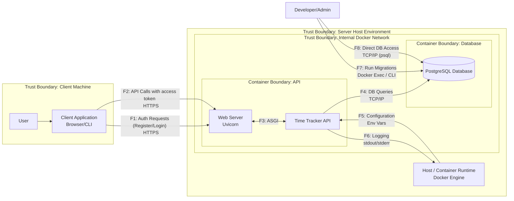

# DFD — Data Flow Diagram
## Диаграмма (Mermaid)

## Список потоков

| ID | Откуда → Куда | Канал/Протокол | Данные/PII | Комментарий |
|---|---|---|---|---|
| F1 | Client App → Web Server | HTTPS | Учётные данные: `username`, `password`. | Регистрация и аутентификация пользователя. |
| F2 | Client App → Web Server | HTTPS + Access Token | Access Token в заголовке `Authorization`, данные проектов и записей (создание, обновление). | Основное взаимодействие авторизованного пользователя с API. |
| F3 | Web Server → Time Tracker API| ASGI | Распарсенный HTTP-запрос, включая заголовки, тело, параметры. | Внутренний поток внутри контейнера. Считается доверенным. |
| F4 | App Logic → Database | TCP/IP (Postgres Protocol) | SQL-запросы, PII пользователя (`username`), хеши паролей, данные проектов/записей. | Взаимодействие приложения с базой данных внутри изолированной сети Docker. |
| F5 | Host Runtime → App Logic | Переменные окружения | `DATABASE_URL` (содержит креды от БД), другие секреты и конфигурационные параметры. | Загрузка конфигурации при старте контейнера. |
| F6 | App Logic → Host Runtime | `stdout`/`stderr` | Журналы событий: IP-адреса, `user_id`, ошибки, трассировки стека, события аудита (успешный/неудачный вход). | Поток логирования. Содержимое логов собирается Docker Engine. Важно не допускать утечки секретов в логи (NFR-05). |
| F7 | Developer → Database | CLI (`alembic` через `docker exec`) | Команды для изменения схемы БД. | Административный процесс для управления миграциями БД. Требует привилегированного доступа к хосту. |
| F8 | Developer → Database | TCP/IP (`psql` или др. клиент) | Прямые SQL-запросы на чтение/изменение данных. | Ручной доступ к БД для отладки или обслуживания. Привилегированный доступ. |
